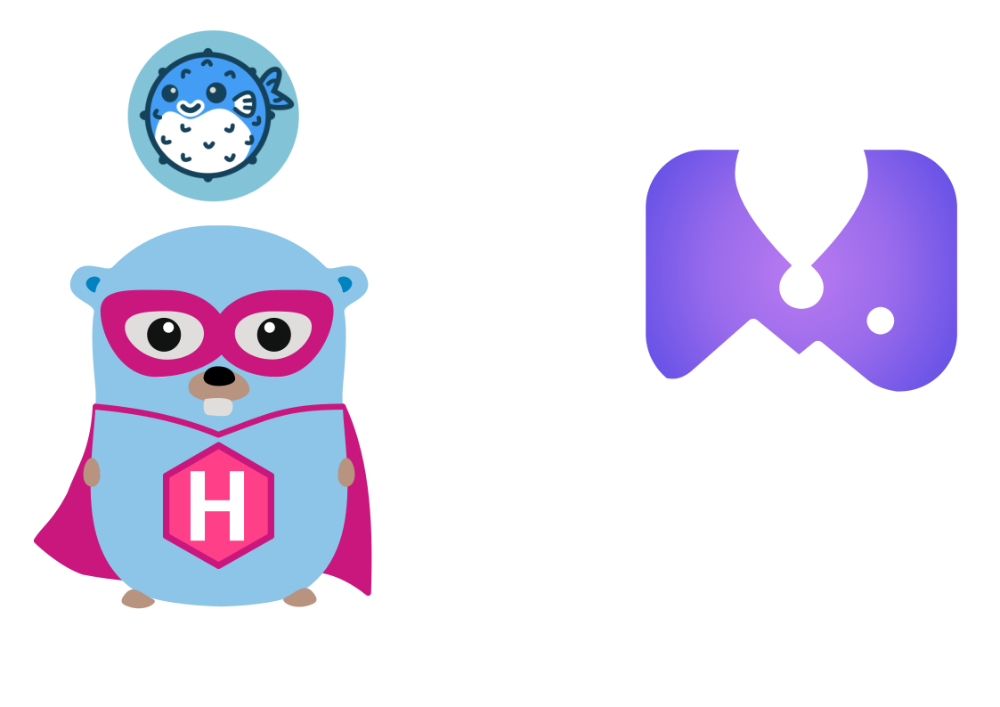
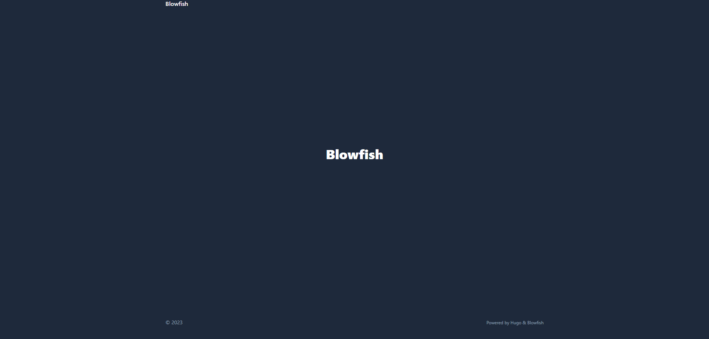

Here we will go through how to bootstrap your own blog using [Hugo](https://gohugo.io) and [fly.io](https://fly.io).

## Prerequisites

Here is a list of toolings you will need to have installed on your machine:

- [Hugo](https://gohugo.io)
- [fly.io](https://fly.io)
- [git](https://git-scm.com)
    - [GitHub](https://github.com) account

Optional:

- [Golang](https://golang.org) (optional, but I will be using it in this guide)
- [Docker](https://www.docker.com) (optional, only needed to run the blog locally using Docker)

## Create a new Hugo site

First, we need to create a new Hugo site. To do so, we will use the `hugo new site` command:

```bash
hugo new site my-blog
```

This will create a new folder called `my-blog` with the following structure:

```bash
my-blog
├── archetypes
├── config.toml
├── content
├── data
├── layouts
├── static
└── themes
```

## Add a theme

Next, we need to add a theme to our blog. For this guide, I will be using the [blowfish](https://themes.gohugo.io/blowfish/) theme. 

1. To add a theme, we will use the `hugo mod init` command:

```bash
hugo mod init github.com/<username>/<repo-name>
```

2. Now we want to add the theme to our blog, so we will reference it in our `config/_default/module.toml` file:

```toml
# config/_default/module.toml
[[imports]]
path = "github.com/nunocoracao/blowfish/v2"
```

3. Start your server using `hugo server` and the theme will be downloaded automatically.

4. In the root folder of your website, delete the config.toml file that was generated by Hugo. Copy the *.toml config files from the theme into your config/_default/ folder.

> **Note:** Do not overwrite the `module.toml` file you created above!

Now so far if we run `hugo server` we will see the following when we access [http://localhost:1313](http://localhost:1313):



From here you can start working on your blog following the [blowfish theme documentation](https://blowfish.page/docs/getting-started/).

**Recomnadation:** I would recommend you to use vendoring to manage your theme dependencies. 

To do so, you can use the `hugo mod vendor` command:

```bash
hugo mod vendor
```

## Add a Dockerfile

Now that we have our blog ready, we need to add a Dockerfile to our project so we can deploy it to fly.io.

Create a new file called `Dockerfile` in the root of your project and add the following content:

```dockerfile
FROM golang:1.19.0-buster AS build

RUN apt update -y 
RUN apt install -y wget
# Install Hugo
RUN wget https://github.com/gohugoio/hugo/releases/download/v0.106.0/hugo_extended_0.106.0_linux-amd64.deb
RUN dpkg -i hugo_extended_0.106.0_linux-amd64.deb
RUN apt-get install -f

WORKDIR /var/hugo/src
COPY . .
RUN hugo --minify

EXPOSE 1313
CMD ["hugo", "server", "--bind", "0.0.0.0"]
```

You can try running `docker build .` to build your image locally.

## Important Configurations

Before we jump to the next step, we need to config a few things on our site.

1. First, we need to add a `baseURL` to our `config/_default/config.toml` file:

```toml
# config/_default/config.toml
baseURL = "https://<your-app-name>.fly.dev"
```

2. Next, we need to add a `publishDir` to our `config/_default/config.toml` file:

```toml
# config/_default/config.toml
publishDir = "public"
```

## Hosting on fly.io

Now we can create a new app on fly.io. 

To do so, we will use the `fly launch` command:

```bash
fly launch
```

This will ask you a few questions about your app. Here are the answers I used:

```bash
? App Name (leave blank to use an auto-generated name):
? Select organization: Mark Ericksen (personal)
? Select region: lax (Los Angeles, California (US))
Created app weathered-wave-1020 in organization personal
Wrote config file fly.toml
? Would you like to deploy now? (y/N)
```

The launch command generates a `fly.toml` file for your project with the settings. You can deploy right away, or add some config first.

Your `fly.toml` file should look something like this:

```toml
app = "<app-name>"
primary_region = "<region-name>"

[http_service]
  internal_port = 1313
  force_https = true
  auto_stop_machines = true
  auto_start_machines = true
  min_machines_running = 0
```

## Automatic Deployment with GitHub Actions

Now that we have our blog ready, we need to automate the deployment process. To do so, we will use `GitHub Actions`.

1. First, we need to create a new file called `.github/workflows/deploy.yml` with the following content:

```yaml
# .github/workflows/deploy.yml
name: Fly Deploy
on:
  push:
    branches:
      - main
jobs:
  deploy:
    name: Deploy app
    runs-on: ubuntu-latest
    environment: production
    steps:
      - uses: actions/checkout@v3
      - uses: superfly/flyctl-actions/setup-flyctl@master
      - run: flyctl deploy --remote-only
        env:
          FLY_API_TOKEN: ${{ secrets.FLY_API_TOKEN }}
```

> Make sure you add a `FLY_API_TOKEN` to your repos environment variables. You can get it from [https://fly.io/user/personal_access_tokens](https://fly.io/user/personal_access_tokens).


## (Optional) Adding a custom domain

If you want to add a custom domain to your blog, first you need a domain. My personal choice was [Namecheap](https://www.namecheap.com/), but there are many other options out there like [GoDaddy](https://www.godaddy.com/), [Hostinger](https://www.hostinger.com/), [AWS Route 53](https://aws.amazon.com/route53/), etc.

Once you have your domain, we'll need to run the following command to add it to our fly.io app:

```bash
fly certs create <your-domain>
```

You'll get prompted with fly needing to verify and configure your domain. Just follow the instructions and add an `A Record` and `AAAA Record` to your DNS provider.

> Important: Don't forget to add the `CNAME` record for `www` as well.

Once it's ready, you can run `fly certs show <your-domain>` to see if everything is working as expected and add any other configuration if needed.

## Summary

Now you have a blog of your own, just like this one. You can now start writing your own posts and deploy them to fly.io.

If you have any questions, feel free to reach out to me on any social.